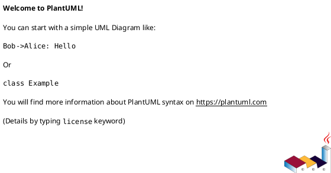

# GENERADOR DE DIAGRAMA UML - SISTEMA "HERMOSA CARTAGENA"

## OPCIÓN 1: PLANTUML ONLINE (Recomendado)

### Pasos para generar el diagrama:

1. **Abrir PlantUML Online**
   - Ir a: https://plantuml.com/online
   - O usar: https://www.planttext.com/

2. **Copiar el código**
   - Abrir el archivo: `diagrama_uml.plantuml`
   - Copiar todo el contenido

3. **Pegar y generar**
   - Pegar el código en el editor online
   - Click en "Generate" o "Render"
   - El diagrama se generará automáticamente

4. **Exportar**
   - Click derecho en el diagrama
   - "Save image as..." para descargar como PNG/SVG

---

## OPCIÓN 2: PLANTUML LOCAL

### Instalación (Windows)

```bash
# Descargar PlantUML JAR
curl -o plantuml.jar https://github.com/plantuml/plantuml/releases/download/v1.2024.3/plantuml-1.2024.3.jar

# Instalar Graphviz (requerido para diagramas complejos)
# Descargar desde: https://graphviz.org/download/
# O usar Chocolatey: choco install graphviz
```

### Generar el diagrama

```bash
# Desde el directorio del proyecto
java -jar plantuml.jar diagrama_uml.plantuml

# Generar PNG
java -jar plantuml.jar -tpng diagrama_uml.plantuml

# Generar SVG (vectorial)
java -jar plantuml.jar -tsvg diagrama_uml.plantuml

# Generar PDF
java -jar plantuml.jar -tpdf diagrama_uml.plantuml
```

---

## OPCIÓN 3: VS CODE EXTENSION

### Instalar extensión

1. **Abrir VS Code**
2. **Ir a Extensions** (Ctrl+Shift+X)
3. **Buscar**: "PlantUML"
4. **Instalar**: "PlantUML" por jebbs.plantuml

### Generar diagrama

1. **Abrir archivo**: `diagrama_uml.plantuml`
2. **Preview**: Ctrl+Shift+P -> "PlantUML: Preview Current Diagram"
3. **Exportar**: Click derecho en preview -> "Export..."

---

## OPCIÓN 4: INTEGRACIÓN CON IDE

### IntelliJ IDEA

1. **File** -> **Settings** -> **Plugins**
2. **Buscar**: "PlantUML integration"
3. **Instalar** y reiniciar IDE
4. **Abrir** archivo `.plantuml`
5. **Click derecho** -> "Show PlantUML Diagram"

### Eclipse

1. **Help** -> **Eclipse Marketplace**
2. **Buscar**: "PlantUML Plugin"
3. **Instalar** y reiniciar
4. **Abrir** archivo `.plantuml`
5. **Right click** -> "Open As" -> "PlantUML Diagram"

---

## OPCIÓN 5: DOCKER

### Usar Docker para generar

```bash
# Crear Dockerfile
cat > Dockerfile << 'EOF'
FROM openjdk:17-jre-slim
WORKDIR /app
COPY plantuml.jar .
COPY diagrama_uml.plantuml .
RUN apt-get update && apt-get install -y graphviz
CMD ["java", "-jar", "plantuml.jar", "diagrama_uml.plantuml"]
EOF

# Construir imagen
docker build -t plantuml-hermosa .

# Generar diagrama
docker run --rm -v $(pwd):/app plantuml-hermosa
```

---

## CARACTERÍSTICAS DEL DIAGRAMA

### ¿Qué incluye el diagrama UML?

#### **Actores**
- Administrador
- Empleado  
- Cliente
- Sistema Externo

#### **Capas del Sistema**
1. **Frontend** (Controllers de UI)
2. **API Gateway** (Puerta de entrada)
3. **Microservicios** (6 servicios principales)
4. **Base de Datos** (MySQL)
5. **Comunicación** (Mensajería distribuida)

#### **Componentes Principales**
- **Auth Service**: Autenticación JWT
- **Usuarios Service**: Gestión de usuarios
- **Servicios Service**: Catálogo de servicios
- **Reservas Service**: Gestión de reservas
- **Pagos Service**: Procesamiento de pagos
- **Reportes Service**: Generación de reportes

#### **Relaciones**
- Herencia entre clases
- Composición y agregación
- Dependencias entre capas
- Flujo de datos entre componentes

#### **Entidades de BD**
- Usuario, Rol, Servicio, Reserva, Pago
- Relaciones completas (OneToMany, ManyToOne)
- Campos de auditoría

---

## PERSONALIZACIÓN DEL DIAGRAMA

### Cambiar colores y estilos

```plantuml
' Al inicio del archivo, puedes modificar:
skinparam class {
    BackgroundColor #LightBlue
    BorderColor #DarkBlue
    ArrowColor #DarkBlue
}

' Cambiar colores específicos
skinparam class.Admin {
    BackgroundColor #LightRed
}
```

### Agregar más detalles

```plantuml
' Para mostrar más métodos:
class UsuarioController {
    +createUsuario(usuarioDTO): UsuarioDTO
    +updateUsuario(id, usuarioDTO): UsuarioDTO
    +getUsuario(id): UsuarioDTO
    +deleteUsuario(id): void
    +searchUsuarios(text): Page<UsuarioDTO>
    +changeStatus(id, status): void
    +resetAttempts(id): void
}
```

### Ocultar detalles

```plantuml
' Para simplificar el diagrama:
hide empty members
hide circle

' O mostrar solo atributos públicos:
show public members
```

---

## FORMATOS DE SALIDA

### **PNG** (Raster)
- **Ventajas**: Compatible con todo, tamaño pequeño
- **Desventajas**: No escalable, pierde calidad al agrandar
- **Uso**: Presentaciones, documentos web

### **SVG** (Vectorial)
- **Ventajas**: Escalable infinitamente, calidad perfecta
- **Desventajas**: Archivo más grande, requiere visor SVG
- **Uso**: Documentación técnica, web

### **PDF** (Documento)
- **Ventajas**: Formato estándar, impresión perfecta
- **Desventajas**: No editable directamente
- **Uso**: Documentación formal, impresión

---

## TROUBLESHOOTING

### Problema: "Graphviz not found"
**Solución**: Instalar Graphviz
```bash
# Windows
choco install graphviz

# Linux
sudo apt-get install graphviz

# macOS
brew install graphviz
```

### Problema: "Diagram too large"
**Solución**: Dividir en múltiples diagramas más pequeños


### Problema: "Memory error"
**Solución**: Aumentar memoria Java
```bash
java -Xmx2g -jar plantuml.jar diagrama_uml.plantuml
```

---

## RECOMENDACIONES

### **Para Documentación Técnica**
- Usar formato **SVG**
- Incluir todos los detalles
- Agregar notas explicativas

### **Para Presentaciones**
- Usar formato **PNG**
- Simplificar componentes
- Resaltar arquitectura principal

### **Para Desarrollo**
- Generar múltiples vistas
- Una por capa/módulo
- Incluir relaciones clave

---

**El diagrama UML generado mostrará la arquitectura completa del sistema "Hermosa Cartagena" con todas sus capas, componentes y relaciones.**
